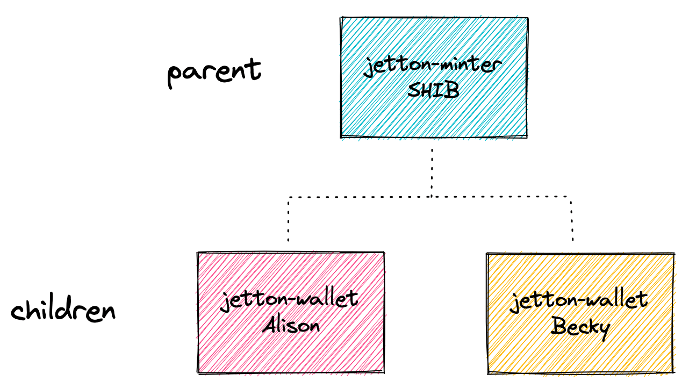

# 🚚 Jetton Implementation Template by Howard

This project is targeting to provide a template for the Jetton Implementation. It's a good start point for the developer to start the Jetton Implementation.

### Usage

```bash
yarn build # To build & compile the contract
yarn test # To run test cases for the contract
yarn deploy # To deploy contract
---
yarn read # To read contract data from the blockchain
yarn d1 # (Optional) To Transfer the Jetton Token to the new account
yarn d2 # (Optional) To generate the Transfer URL to let the new account to transfer the Jetton Token to the other account
```

🔍 Detail can be found in `package.json` LOL

# ✨ Important knowledge points



-   Store the Jetton content in the `Cell` data type.
-   Use lowercase for the name in `get_jetton_data()` as per [TEP-74](https://github.com/ton-blockchain/TEPs/blob/master/text/0074-jettons-standard.md). Otherwise, major explorers won't be able to read the Jetton information correctly.
-   The `max_supply` parameter is optional. You can choose to use it or not. Regardless, the Explorer will only track the `Total Supply` in the Jetton Root Contract.
-   In Jetton, if you want to transfer your Jetton Token to someone, you need to send a message to YOUR Jetton Wallet, not to the new recipient's wallet.
-   forward_ton_amount can be set as lower as possible: Same as [TelemintNFT](https://github.com/TelegramMessenger/telemint). I don't know why, but looks like we can set (1e-9 TON) in forward_ton_amount without any error.

### Reference

-   https://blog.ton.org/how-to-shard-your-ton-smart-contract-and-why-studying-the-anatomy-of-tons-jettons
-   https://github.com/ton-blockchain/TEPs/blob/master/text/0074-jettons-standard.md
-   https://docs.ton.org/develop/dapps/asset-processing/jettons
-   https://docs.tact-lang.org/learn/jetton/jetton-3

## Community

-   Tact Lang Community (https://t.me/tactlang)
-   Ton101 (https://t.me/ton101)
-   TON Dev Chat[EN] (https://t.me/tondev_eng)
-   TON Dev 中文 (https://t.me/tondev_zh)

## Deployment

To deploy contract you should:

1. Specify `contract.tact` that will be used as entry point of your contract
2. Configure `contract.deploy.ts` according to your `contract.tact` to generate a deployment link. In particular, it is necessary to correctly call the Init() function from the contract.

If you renamed `contract.tact` to something else, you need to update `tact.config.json` correspondingly. For more information , see [Tact Documentation](https://docs.tact-lang.org/language/guides/config)

## Testing

Example of contract tests are in `contract.spec.ts`. For more information about testing, see [Tact Documentation](https://docs.tact-lang.org/language/guides/debug)

To add new test files to contract you should create `*.spec.ts` files similar to template's one and they would be automatically included in testing.

## Licence

MIT
